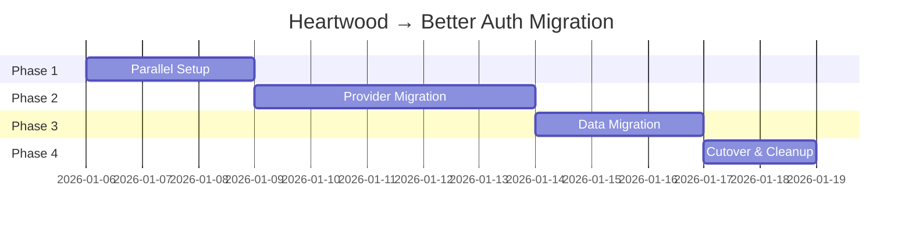

# Heartwood → Better Auth Migration Plan

```
                          ╭──────────╮
                       ╭──│ ╭──────╮ │──╮
                     ╭─│  │ │ ╭──╮ │ │  │─╮
                    │  │  │ │ │→ │ │ │  │  │
                     ╰─│  │ │ ╰──╯ │ │  │─╯
                       ╰──│ ╰──────╯ │──╯
                          ╰──────────╯

       from custom rings to community roots
```

> **Migration Type**: Authentication Infrastructure
> **Status**: Planning
> **Target**: Better Auth with Cloudflare Integration
> **Author**: Claude (with guidance from Autumn)
> **Created**: January 2026

---

## Table of Contents

1. [Executive Summary](#executive-summary)
2. [Architecture Comparison](#architecture-comparison)
3. [Migration Phases](#migration-phases)
4. [Schema Documentation](#schema-documentation)
5. [Integration Points](#integration-points)
6. [Rollback Plan](#rollback-plan)
7. [Performance Expectations](#performance-expectations)

---

## Executive Summary

### The Problem

Heartwood, Grove's custom authentication system, has a critical performance issue: **login flows take ~15 seconds**. This is unacceptable for public launch. The delay stems from the multi-hop architecture between OAuth providers, the GroveAuth Worker, session coordination, and D1 writes.

### The Solution

Migrate to **Better Auth**, a modern, production-ready authentication library with first-class Cloudflare support via `better-auth-cloudflare`. This provides:

- **Edge-native session handling** with KV caching
- **Built-in OAuth** with optimized flows
- **Magic links** (replacing our 6-digit codes)
- **Passkey/WebAuthn** support (new capability)
- **Drizzle ORM** integration for type-safe database operations

### Goals

| Goal | Metric |
|------|--------|
| Login latency | 15s → <2s |
| Session validation | 50-200ms → <5ms |
| Passwordless auth | 6-digit codes → magic links |
| New capabilities | Add passkey/WebAuthn support |
| Developer experience | Type-safe, documented API |

### Non-Goals

- Adding username/password authentication
- Public registration (remain allowlist-based)
- Changing the overall Grove authentication model

---

## Architecture Comparison

### Current Heartwood Architecture

```
┌─────────────────────────────────────────────────────────────────────────┐
│                          HEARTWOOD (Current)                             │
└─────────────────────────────────────────────────────────────────────────┘

┌──────────────┐     ┌──────────────────┐     ┌────────────────────────────┐
│ Client Site  │────▶│ GroveAuth Worker │────▶│ OAuth Providers            │
│ (Engine)     │     │ (Hono.js)        │     │ (Google, GitHub)           │
└──────────────┘     └────────┬─────────┘     └────────────────────────────┘
       │                      │                          │
       │                      ▼                          │
       │             ┌────────────────┐                  │
       │             │  D1 Database   │◀─────────────────┘
       │             │  - users       │
       │             │  - sessions    │
       │             │  - magic_codes │
       │             │  - rate_limits │
       │             └────────────────┘
       │                      │
       ▼                      ▼
┌──────────────┐     ┌────────────────┐
│  SessionDO   │────▶│ Session State  │
│  (per-user)  │     │ (SQLite in DO) │
└──────────────┘     └────────────────┘
```

**Problems:**
1. Multiple Workers involved in auth flow
2. D1 writes on every login (slow)
3. SessionDO adds complexity without solving core latency
4. Magic codes require email round-trip + user action
5. Custom JWT implementation requires maintenance

### Target Better Auth Architecture

```
┌─────────────────────────────────────────────────────────────────────────┐
│                          BETTER AUTH (Target)                            │
└─────────────────────────────────────────────────────────────────────────┘

┌──────────────┐     ┌──────────────────┐     ┌────────────────────────────┐
│ Client Site  │────▶│ Better Auth      │────▶│ OAuth Providers            │
│ (Engine)     │     │ (Edge Runtime)   │     │ (Google, GitHub)           │
└──────────────┘     └────────┬─────────┘     └────────────────────────────┘
                              │
              ┌───────────────┼───────────────┐
              ▼               ▼               ▼
     ┌────────────────┐ ┌──────────┐ ┌─────────────────┐
     │  D1 Database   │ │ KV Cache │ │ Resend (Email)  │
     │  (Drizzle ORM) │ │ Sessions │ │ Magic Links     │
     │  - user        │ └──────────┘ └─────────────────┘
     │  - session     │
     │  - account     │
     │  - verification│
     └────────────────┘
```

**Improvements:**
1. Single Worker handles entire auth flow
2. KV caching for sub-millisecond session reads
3. Magic links (one-click) instead of codes
4. Passkey support built-in
5. Drizzle ORM for type-safe queries

---

### Data Model Comparison

#### Users

| Heartwood Field | Better Auth Field | Notes |
|-----------------|-------------------|-------|
| `id` (UUID) | `id` (string) | Direct mapping |
| `groveauth_id` | - | Replaced by `account.providerAccountId` |
| `email` | `email` | Direct mapping |
| `display_name` | `name` | Renamed |
| `avatar_url` | `image` | Renamed |
| `tenant_id` | - | Custom field, preserve |
| `last_login_at` | `updatedAt` | Approximate (update on login) |
| `login_count` | - | Custom field, preserve or drop |
| `is_active` | `banned`, `banReason`, `banExpires` | Better Auth has richer ban model |
| `created_at` | `createdAt` | Direct mapping |
| `updated_at` | `updatedAt` | Direct mapping |

#### Sessions

| Heartwood Field | Better Auth Field | Notes |
|-----------------|-------------------|-------|
| `id` (token) | `token` | Direct mapping |
| `tenant_id` | - | Drop (user-level, not session-level) |
| `user_email` | - | Replaced by `userId` FK |
| `expires_at` | `expiresAt` | Direct mapping |
| `created_at` | `createdAt` | Direct mapping |
| - | `userId` | New: FK to user table |
| - | `ipAddress` | New: Optional IP tracking |
| - | `userAgent` | New: Optional UA tracking |

#### OAuth Accounts

| Heartwood Field | Better Auth Field | Notes |
|-----------------|-------------------|-------|
| `provider` (on user) | `providerId` | e.g., "google", "github" |
| `provider_id` (on user) | `accountId` | Provider's user ID |
| - | `accessToken` | New: Stored encrypted |
| - | `refreshToken` | New: Stored encrypted |
| - | `accessTokenExpiresAt` | New: For token refresh |
| - | `scope` | New: OAuth scopes granted |

#### Magic Codes → Verifications

| Heartwood Field | Better Auth Field | Notes |
|-----------------|-------------------|-------|
| `id` | `id` | Direct mapping |
| `email` | `identifier` | Renamed, more generic |
| `code` | `value` | Renamed, stores token not code |
| `created_at` | `createdAt` | Direct mapping |
| `expires_at` | `expiresAt` | Direct mapping |
| `used` | - | Deleted on use instead |

---

## Migration Phases

### Overview



---

### Phase 1: Parallel Setup

**Goal**: Install Better Auth alongside Heartwood without disrupting existing auth.

#### 1.1 Install Dependencies

```bash
cd packages/engine
pnpm add better-auth better-auth-cloudflare @better-auth/cli drizzle-orm
```

#### 1.2 Create Better Auth Configuration

```typescript
// src/lib/server/auth/better-auth.ts
import { betterAuth } from "better-auth";
import { cloudflare } from "better-auth-cloudflare";
import { drizzleAdapter } from "better-auth/adapters/drizzle";
import { passkey } from "@better-auth/passkey";
import { magicLink } from "@better-auth/magic-link";

export function createAuth(env: Env) {
  return betterAuth({
    // Database adapter using D1 via Drizzle
    database: drizzleAdapter(env.DB, {
      provider: "sqlite",
      schema: {
        user: "ba_user",
        session: "ba_session",
        account: "ba_account",
        verification: "ba_verification",
      },
    }),

    // Session storage in KV for edge-fast reads
    session: {
      strategy: "database", // Also writes to D1 for durability
      expiresIn: 60 * 60 * 24 * 30, // 30 days
      updateAge: 60 * 60 * 24, // Update session daily
      cookieCache: {
        enabled: true,
        maxAge: 60 * 5, // 5-minute client cache
      },
    },

    // Secondary session cache in KV
    secondaryStorage: cloudflare({
      kv: env.AUTH_SESSIONS, // KV namespace for sessions
    }),

    // OAuth providers
    socialProviders: {
      google: {
        clientId: env.GOOGLE_CLIENT_ID,
        clientSecret: env.GOOGLE_CLIENT_SECRET,
        scope: ["openid", "email", "profile"],
      },
      github: {
        clientId: env.GITHUB_CLIENT_ID,
        clientSecret: env.GITHUB_CLIENT_SECRET,
        scope: ["user:email", "read:user"],
      },
    },

    // Plugins
    plugins: [
      // Magic link authentication (replaces magic codes)
      magicLink({
        sendMagicLink: async ({ email, url }) => {
          await fetch("https://api.resend.com/emails", {
            method: "POST",
            headers: {
              "Authorization": `Bearer ${env.RESEND_API_KEY}`,
              "Content-Type": "application/json",
            },
            body: JSON.stringify({
              from: "Grove <noreply@grove.place>",
              to: email,
              subject: "Sign in to Grove",
              html: `
                <p>Click the link below to sign in to Grove:</p>
                <a href="${url}">Sign in to Grove</a>
                <p>This link expires in 10 minutes.</p>
                <p>If you didn't request this, you can safely ignore this email.</p>
              `,
            }),
          });
        },
        expiresIn: 60 * 10, // 10 minutes
      }),

      // Passkey/WebAuthn support (new capability!)
      passkey({
        rpID: "grove.place",
        rpName: "Grove",
        origin: "https://grove.place",
      }),
    ],

    // Custom user fields for Grove
    user: {
      additionalFields: {
        tenantId: {
          type: "string",
          required: false,
        },
        loginCount: {
          type: "number",
          required: false,
          defaultValue: 0,
        },
      },
    },

    // Rate limiting
    rateLimit: {
      window: 60, // 1 minute
      max: 10, // 10 requests per minute per IP
    },

    // Trusted origins
    trustedOrigins: [
      "https://grove.place",
      "https://*.grove.place",
    ],
  });
}

export type Auth = ReturnType<typeof createAuth>;
```

#### 1.3 Create Drizzle Schema

```typescript
// src/lib/server/db/schema/auth.ts
import { sqliteTable, text, integer } from "drizzle-orm/sqlite-core";

// Better Auth tables (prefixed with ba_ to avoid conflicts)
export const baUser = sqliteTable("ba_user", {
  id: text("id").primaryKey(),
  name: text("name"),
  email: text("email").notNull().unique(),
  emailVerified: integer("emailVerified", { mode: "boolean" }),
  image: text("image"),
  // Grove custom fields
  tenantId: text("tenant_id"),
  loginCount: integer("login_count").default(0),
  // Ban fields (Better Auth built-in)
  banned: integer("banned", { mode: "boolean" }),
  banReason: text("ban_reason"),
  banExpires: integer("ban_expires"),
  // Timestamps
  createdAt: integer("created_at", { mode: "timestamp" }).notNull(),
  updatedAt: integer("updated_at", { mode: "timestamp" }).notNull(),
});

export const baSession = sqliteTable("ba_session", {
  id: text("id").primaryKey(),
  token: text("token").notNull().unique(),
  userId: text("user_id")
    .notNull()
    .references(() => baUser.id, { onDelete: "cascade" }),
  expiresAt: integer("expires_at", { mode: "timestamp" }).notNull(),
  ipAddress: text("ip_address"),
  userAgent: text("user_agent"),
  createdAt: integer("created_at", { mode: "timestamp" }).notNull(),
  updatedAt: integer("updated_at", { mode: "timestamp" }).notNull(),
});

export const baAccount = sqliteTable("ba_account", {
  id: text("id").primaryKey(),
  userId: text("user_id")
    .notNull()
    .references(() => baUser.id, { onDelete: "cascade" }),
  accountId: text("account_id").notNull(), // Provider's user ID
  providerId: text("provider_id").notNull(), // e.g., "google", "github"
  accessToken: text("access_token"),
  refreshToken: text("refresh_token"),
  accessTokenExpiresAt: integer("access_token_expires_at", { mode: "timestamp" }),
  refreshTokenExpiresAt: integer("refresh_token_expires_at", { mode: "timestamp" }),
  scope: text("scope"),
  idToken: text("id_token"),
  createdAt: integer("created_at", { mode: "timestamp" }).notNull(),
  updatedAt: integer("updated_at", { mode: "timestamp" }).notNull(),
});

export const baVerification = sqliteTable("ba_verification", {
  id: text("id").primaryKey(),
  identifier: text("identifier").notNull(), // email or phone
  value: text("value").notNull(), // token/code
  expiresAt: integer("expires_at", { mode: "timestamp" }).notNull(),
  createdAt: integer("created_at", { mode: "timestamp" }).notNull(),
  updatedAt: integer("updated_at", { mode: "timestamp" }).notNull(),
});

// Passkey credentials (for WebAuthn)
export const baPasskey = sqliteTable("ba_passkey", {
  id: text("id").primaryKey(),
  userId: text("user_id")
    .notNull()
    .references(() => baUser.id, { onDelete: "cascade" }),
  name: text("name"), // User-friendly name like "MacBook Pro"
  publicKey: text("public_key").notNull(),
  credentialId: text("credential_id").notNull().unique(),
  counter: integer("counter").notNull().default(0),
  deviceType: text("device_type"), // "singleDevice" or "multiDevice"
  backedUp: integer("backed_up", { mode: "boolean" }),
  transports: text("transports"), // JSON array
  createdAt: integer("created_at", { mode: "timestamp" }).notNull(),
});
```

#### 1.4 Create D1 Migration

```sql
-- migrations/015_better_auth.sql
-- Better Auth tables (parallel to Heartwood during migration)

-- =============================================================================
-- USERS (Better Auth)
-- =============================================================================
CREATE TABLE IF NOT EXISTS ba_user (
  id TEXT PRIMARY KEY,
  name TEXT,
  email TEXT NOT NULL UNIQUE,
  email_verified INTEGER,
  image TEXT,
  -- Grove custom fields
  tenant_id TEXT,
  login_count INTEGER DEFAULT 0,
  -- Ban fields
  banned INTEGER,
  ban_reason TEXT,
  ban_expires INTEGER,
  -- Timestamps
  created_at INTEGER NOT NULL,
  updated_at INTEGER NOT NULL,

  FOREIGN KEY (tenant_id) REFERENCES tenants(id) ON DELETE SET NULL
);

CREATE INDEX IF NOT EXISTS idx_ba_user_email ON ba_user(email);
CREATE INDEX IF NOT EXISTS idx_ba_user_tenant ON ba_user(tenant_id);

-- =============================================================================
-- SESSIONS (Better Auth)
-- =============================================================================
CREATE TABLE IF NOT EXISTS ba_session (
  id TEXT PRIMARY KEY,
  token TEXT NOT NULL UNIQUE,
  user_id TEXT NOT NULL,
  expires_at INTEGER NOT NULL,
  ip_address TEXT,
  user_agent TEXT,
  created_at INTEGER NOT NULL,
  updated_at INTEGER NOT NULL,

  FOREIGN KEY (user_id) REFERENCES ba_user(id) ON DELETE CASCADE
);

CREATE INDEX IF NOT EXISTS idx_ba_session_token ON ba_session(token);
CREATE INDEX IF NOT EXISTS idx_ba_session_user ON ba_session(user_id);
CREATE INDEX IF NOT EXISTS idx_ba_session_expires ON ba_session(expires_at);

-- =============================================================================
-- ACCOUNTS (OAuth providers)
-- =============================================================================
CREATE TABLE IF NOT EXISTS ba_account (
  id TEXT PRIMARY KEY,
  user_id TEXT NOT NULL,
  account_id TEXT NOT NULL,
  provider_id TEXT NOT NULL,
  access_token TEXT,
  refresh_token TEXT,
  access_token_expires_at INTEGER,
  refresh_token_expires_at INTEGER,
  scope TEXT,
  id_token TEXT,
  created_at INTEGER NOT NULL,
  updated_at INTEGER NOT NULL,

  FOREIGN KEY (user_id) REFERENCES ba_user(id) ON DELETE CASCADE
);

CREATE INDEX IF NOT EXISTS idx_ba_account_user ON ba_account(user_id);
CREATE UNIQUE INDEX IF NOT EXISTS idx_ba_account_provider ON ba_account(provider_id, account_id);

-- =============================================================================
-- VERIFICATIONS (Magic links, email verification)
-- =============================================================================
CREATE TABLE IF NOT EXISTS ba_verification (
  id TEXT PRIMARY KEY,
  identifier TEXT NOT NULL,
  value TEXT NOT NULL,
  expires_at INTEGER NOT NULL,
  created_at INTEGER NOT NULL,
  updated_at INTEGER NOT NULL
);

CREATE INDEX IF NOT EXISTS idx_ba_verification_identifier ON ba_verification(identifier);
CREATE INDEX IF NOT EXISTS idx_ba_verification_expires ON ba_verification(expires_at);

-- =============================================================================
-- PASSKEYS (WebAuthn credentials)
-- =============================================================================
CREATE TABLE IF NOT EXISTS ba_passkey (
  id TEXT PRIMARY KEY,
  user_id TEXT NOT NULL,
  name TEXT,
  public_key TEXT NOT NULL,
  credential_id TEXT NOT NULL UNIQUE,
  counter INTEGER NOT NULL DEFAULT 0,
  device_type TEXT,
  backed_up INTEGER,
  transports TEXT,
  created_at INTEGER NOT NULL,

  FOREIGN KEY (user_id) REFERENCES ba_user(id) ON DELETE CASCADE
);

CREATE INDEX IF NOT EXISTS idx_ba_passkey_user ON ba_passkey(user_id);
CREATE INDEX IF NOT EXISTS idx_ba_passkey_credential ON ba_passkey(credential_id);
```

#### 1.5 Update wrangler.toml

```toml
# packages/engine/wrangler.toml

# Add KV namespace for session caching
[[kv_namespaces]]
binding = "AUTH_SESSIONS"
id = "your-kv-namespace-id"       # Production
# preview_id = "your-preview-id"  # For wrangler dev

# Existing D1 binding (unchanged)
[[d1_databases]]
binding = "DB"
database_name = "grove-engine-db"
database_id = "your-database-id"

# Remove AUTH service binding after cutover (Phase 4)
# [[services]]
# binding = "AUTH"
# service = "groveauth"
```

Create the KV namespace:

```bash
# Create KV namespace for session caching
wrangler kv:namespace create AUTH_SESSIONS
wrangler kv:namespace create AUTH_SESSIONS --preview
```

---

### Phase 2: Provider Migration

**Goal**: Configure all authentication providers in Better Auth.

#### 2.1 Google OAuth Configuration

Update Google Cloud Console:
1. Go to [Google Cloud Console](https://console.cloud.google.com/)
2. Navigate to **APIs & Services** → **Credentials**
3. Edit your OAuth 2.0 Client ID
4. Add authorized redirect URIs:
   - `https://grove.place/api/auth/callback/google`
   - `https://*.grove.place/api/auth/callback/google`
   - `http://localhost:5173/api/auth/callback/google` (development)

```typescript
// No code changes needed - already configured in createAuth()
socialProviders: {
  google: {
    clientId: env.GOOGLE_CLIENT_ID,
    clientSecret: env.GOOGLE_CLIENT_SECRET,
    scope: ["openid", "email", "profile"],
  },
},
```

#### 2.2 GitHub OAuth Configuration

Update GitHub OAuth App:
1. Go to [GitHub Developer Settings](https://github.com/settings/developers)
2. Edit your OAuth App
3. Update Authorization callback URL:
   - `https://grove.place/api/auth/callback/github`

```typescript
// No code changes needed - already configured in createAuth()
socialProviders: {
  github: {
    clientId: env.GITHUB_CLIENT_ID,
    clientSecret: env.GITHUB_CLIENT_SECRET,
    scope: ["user:email", "read:user"],
  },
},
```

#### 2.3 Magic Link Setup

Magic links replace the 6-digit magic codes. Better Auth handles link generation; we configure email delivery via Resend.

```typescript
// Already configured in createAuth(), but here's the Resend template:
const magicLinkEmail = `
<!DOCTYPE html>
<html>
<head>
  <style>
    body { font-family: -apple-system, BlinkMacSystemFont, 'Segoe UI', Roboto, sans-serif; }
    .container { max-width: 480px; margin: 0 auto; padding: 32px; }
    .button {
      display: inline-block;
      background: #2d5a27;
      color: white;
      padding: 12px 24px;
      border-radius: 8px;
      text-decoration: none;
      margin: 24px 0;
    }
    .footer { color: #666; font-size: 14px; margin-top: 32px; }
  </style>
</head>
<body>
  <div class="container">
    <h1>Sign in to Grove</h1>
    <p>Click the button below to sign in. This link expires in 10 minutes.</p>
    <a href="{{url}}" class="button">Sign in to Grove</a>
    <p class="footer">
      If you didn't request this, you can safely ignore this email.
      <br>
      This link can only be used once.
    </p>
  </div>
</body>
</html>
`;
```

#### 2.4 Passkey Configuration

Passkeys are a new capability not available in Heartwood. They provide passwordless, phishing-resistant authentication.

```typescript
// Already configured in createAuth()
plugins: [
  passkey({
    rpID: "grove.place",        // Relying Party ID (your domain)
    rpName: "Grove",            // Display name in passkey prompts
    origin: "https://grove.place",

    // Optional: Customize attestation
    attestation: "none",        // "none", "indirect", or "direct"

    // Optional: User verification requirement
    userVerification: "preferred", // "required", "preferred", or "discouraged"
  }),
],
```

**Frontend Passkey Registration:**

```typescript
// src/lib/auth/passkey.ts
import { client } from "$lib/auth/client";

export async function registerPasskey() {
  const result = await client.passkey.register({
    name: getDeviceName(), // "MacBook Pro", "iPhone 15", etc.
  });

  if (result.error) {
    throw new Error(result.error.message);
  }

  return result.data;
}

export async function authenticateWithPasskey() {
  const result = await client.passkey.authenticate();

  if (result.error) {
    throw new Error(result.error.message);
  }

  return result.data;
}

function getDeviceName(): string {
  const ua = navigator.userAgent;
  if (ua.includes("Mac")) return "Mac";
  if (ua.includes("iPhone")) return "iPhone";
  if (ua.includes("iPad")) return "iPad";
  if (ua.includes("Android")) return "Android";
  if (ua.includes("Windows")) return "Windows PC";
  return "Unknown Device";
}
```

---

### Phase 3: Data Migration

**Goal**: Migrate existing users while preserving all data and associations.

#### 3.1 Migration Script

```typescript
// scripts/migrate-heartwood-to-better-auth.ts

import { drizzle } from "drizzle-orm/d1";

interface HeartwordUser {
  id: string;
  groveauth_id: string;
  email: string;
  display_name: string | null;
  avatar_url: string | null;
  tenant_id: string | null;
  last_login_at: number | null;
  login_count: number;
  is_active: number;
  created_at: number;
  updated_at: number;
}

interface HeartwordSession {
  id: string;
  tenant_id: string;
  user_email: string;
  expires_at: number;
  created_at: number;
}

export async function migrateUsers(db: D1Database) {
  console.log("Starting Heartwood → Better Auth migration...");

  // 1. Fetch all Heartwood users
  const users = await db
    .prepare("SELECT * FROM users")
    .all<HeartwordUser>();

  console.log(`Found ${users.results.length} users to migrate`);

  // 2. Migrate each user
  for (const user of users.results) {
    const now = Date.now();

    // Insert into Better Auth user table
    await db
      .prepare(`
        INSERT INTO ba_user (
          id, name, email, email_verified, image,
          tenant_id, login_count, banned, created_at, updated_at
        ) VALUES (?, ?, ?, ?, ?, ?, ?, ?, ?, ?)
        ON CONFLICT (email) DO UPDATE SET
          name = excluded.name,
          image = excluded.image,
          tenant_id = excluded.tenant_id,
          login_count = excluded.login_count,
          updated_at = excluded.updated_at
      `)
      .bind(
        user.id,
        user.display_name,
        user.email,
        1, // email_verified = true (they've logged in before)
        user.avatar_url,
        user.tenant_id,
        user.login_count,
        user.is_active === 0 ? 1 : 0, // banned = inverse of is_active
        user.created_at || now,
        now
      )
      .run();

    // Create account record for OAuth provider
    // Note: We don't have provider info in current schema
    // This will be populated on next login
    if (user.groveauth_id) {
      await db
        .prepare(`
          INSERT INTO ba_account (
            id, user_id, account_id, provider_id, created_at, updated_at
          ) VALUES (?, ?, ?, ?, ?, ?)
          ON CONFLICT DO NOTHING
        `)
        .bind(
          crypto.randomUUID(),
          user.id,
          user.groveauth_id,
          "google", // Assumption: most users are Google OAuth
          user.created_at || now,
          now
        )
        .run();
    }

    console.log(`Migrated user: ${user.email}`);
  }

  console.log("User migration complete!");
}

export async function migrateSessions(db: D1Database, strategy: "clean" | "preserve") {
  if (strategy === "clean") {
    console.log("Clean session cutover: All users will need to re-login");
    // Better Auth will create new sessions on login
    return;
  }

  // Preserve strategy: Migrate active sessions
  // Note: This is complex because session formats differ significantly
  // Recommended: Use clean cutover during low-traffic period

  const sessions = await db
    .prepare(`
      SELECT s.*, u.id as user_id
      FROM sessions s
      JOIN users u ON u.email = s.user_email
      WHERE s.expires_at > unixepoch()
    `)
    .all<HeartwordSession & { user_id: string }>();

  console.log(`Found ${sessions.results.length} active sessions`);

  for (const session of sessions.results) {
    const token = crypto.randomUUID(); // Generate new session token
    const now = Date.now();

    await db
      .prepare(`
        INSERT INTO ba_session (
          id, token, user_id, expires_at, created_at, updated_at
        ) VALUES (?, ?, ?, ?, ?, ?)
      `)
      .bind(
        session.id,
        token,
        session.user_id,
        session.expires_at * 1000, // Convert to milliseconds
        session.created_at * 1000,
        now
      )
      .run();
  }

  console.log("Session migration complete!");
}

// Run migration
export async function runMigration(env: Env) {
  const db = env.DB;

  // Step 1: Migrate users
  await migrateUsers(db);

  // Step 2: Handle sessions (recommend clean cutover)
  await migrateSessions(db, "clean");

  console.log("Migration complete! Users will need to re-login.");
}
```

#### 3.2 Account Linking Preservation

Better Auth automatically handles account linking. When a user logs in via a new provider with the same email, it links to their existing account.

```typescript
// Better Auth handles this automatically via:
// 1. Look up user by email from OAuth profile
// 2. If user exists, create new account record linked to user
// 3. If user doesn't exist, create both user and account

// To verify account linking after migration:
const user = await db
  .prepare(`
    SELECT u.*, GROUP_CONCAT(a.provider_id) as providers
    FROM ba_user u
    LEFT JOIN ba_account a ON a.user_id = u.id
    WHERE u.email = ?
    GROUP BY u.id
  `)
  .bind(email)
  .first();

console.log(`User ${email} has providers: ${user.providers}`);
```

---

### Phase 4: Cutover

**Goal**: Switch all traffic from Heartwood to Better Auth.

#### 4.1 Create Better Auth Routes

```typescript
// src/routes/api/auth/[...path]/+server.ts
import { createAuth } from "$lib/server/auth/better-auth";
import type { RequestHandler } from "./$types";

export const GET: RequestHandler = async ({ request, platform }) => {
  const auth = createAuth(platform!.env);
  return auth.handler(request);
};

export const POST: RequestHandler = async ({ request, platform }) => {
  const auth = createAuth(platform!.env);
  return auth.handler(request);
};
```

#### 4.2 Update Session Validation Hook

```typescript
// src/hooks.server.ts (updated auth section)
import { createAuth } from "$lib/server/auth/better-auth";

export const handle: Handle = async ({ event, resolve }) => {
  // ... (Turnstile and subdomain routing unchanged)

  // =========================================================================
  // AUTHENTICATION (Better Auth)
  // =========================================================================
  if (event.platform?.env) {
    const auth = createAuth(event.platform.env);
    const session = await auth.api.getSession({
      headers: event.request.headers,
    });

    if (session?.user) {
      event.locals.user = {
        id: session.user.id,
        email: session.user.email,
        name: session.user.name ?? undefined,
        picture: session.user.image ?? undefined,
        tenantId: session.user.tenantId,
      };
    }
  }

  // ... (CSRF and security headers unchanged)
};
```

#### 4.3 Create Auth Client for Frontend

```typescript
// src/lib/auth/client.ts
import { createAuthClient } from "better-auth/svelte";

export const client = createAuthClient({
  baseURL: "/api/auth", // Relative to current origin
});

// Re-export useful utilities
export const {
  signIn,
  signOut,
  signUp,
  useSession,
} = client;
```

#### 4.4 Update Login Page

```svelte
<!-- src/routes/auth/login/+page.svelte -->
<script lang="ts">
  import { client } from "$lib/auth/client";
  import { goto } from "$app/navigation";

  let email = "";
  let loading = false;
  let error: string | null = null;
  let magicLinkSent = false;

  async function signInWithGoogle() {
    loading = true;
    error = null;

    const result = await client.signIn.social({
      provider: "google",
      callbackURL: "/admin",
    });

    if (result.error) {
      error = result.error.message;
      loading = false;
    }
    // Otherwise, user is redirected to Google
  }

  async function signInWithGitHub() {
    loading = true;
    error = null;

    const result = await client.signIn.social({
      provider: "github",
      callbackURL: "/admin",
    });

    if (result.error) {
      error = result.error.message;
      loading = false;
    }
  }

  async function signInWithEmail() {
    if (!email) {
      error = "Please enter your email";
      return;
    }

    loading = true;
    error = null;

    const result = await client.signIn.magicLink({
      email,
      callbackURL: "/admin",
    });

    if (result.error) {
      error = result.error.message;
      loading = false;
    } else {
      magicLinkSent = true;
      loading = false;
    }
  }

  async function signInWithPasskey() {
    loading = true;
    error = null;

    const result = await client.signIn.passkey();

    if (result.error) {
      error = result.error.message;
      loading = false;
    } else {
      goto("/admin");
    }
  }
</script>

<div class="login-container">
  <h1>Sign in to Grove</h1>

  {#if error}
    <div class="error">{error}</div>
  {/if}

  {#if magicLinkSent}
    <div class="success">
      <h2>Check your email!</h2>
      <p>We sent a magic link to <strong>{email}</strong></p>
      <p>Click the link in the email to sign in.</p>
    </div>
  {:else}
    <div class="providers">
      <button onclick={signInWithGoogle} disabled={loading}>
        Sign in with Google
      </button>

      <button onclick={signInWithGitHub} disabled={loading}>
        Sign in with GitHub
      </button>

      <button onclick={signInWithPasskey} disabled={loading}>
        Sign in with Passkey
      </button>
    </div>

    <div class="divider">or</div>

    <form onsubmit|preventDefault={signInWithEmail}>
      <input
        type="email"
        bind:value={email}
        placeholder="you@example.com"
        disabled={loading}
      />
      <button type="submit" disabled={loading}>
        Send Magic Link
      </button>
    </form>
  {/if}
</div>
```

#### 4.5 Heartwood Cleanup

After successful cutover and monitoring period (1-2 weeks):

```sql
-- migrations/016_heartwood_cleanup.sql
-- Run ONLY after confirming Better Auth is working

-- 1. Backup Heartwood tables (optional, for audit trail)
-- CREATE TABLE _archive_users AS SELECT * FROM users;
-- CREATE TABLE _archive_sessions AS SELECT * FROM sessions;
-- CREATE TABLE _archive_magic_codes AS SELECT * FROM magic_codes;

-- 2. Drop Heartwood tables
DROP TABLE IF EXISTS magic_codes;
DROP TABLE IF EXISTS rate_limits;
DROP TABLE IF EXISTS failed_attempts;
DROP TABLE IF EXISTS sessions;  -- The old sessions table

-- 3. Rename Better Auth tables (remove ba_ prefix)
-- ALTER TABLE ba_user RENAME TO auth_user;
-- ALTER TABLE ba_session RENAME TO auth_session;
-- ALTER TABLE ba_account RENAME TO auth_account;
-- ALTER TABLE ba_verification RENAME TO auth_verification;
-- ALTER TABLE ba_passkey RENAME TO auth_passkey;

-- 4. Update foreign keys in users table
-- (If you kept the old users table for tenant_id reference)
-- This depends on your final schema decision
```

Update wrangler.toml to remove AUTH service binding:

```toml
# Remove this section after cutover:
# [[services]]
# binding = "AUTH"
# service = "groveauth"
```

---

## Schema Documentation

### Final Better Auth Schema

```mermaid
erDiagram
    ba_user ||--o{ ba_session : has
    ba_user ||--o{ ba_account : has
    ba_user ||--o{ ba_passkey : has
    ba_user ||--o| tenants : owns

    ba_user {
        text id PK
        text name
        text email UK
        integer email_verified
        text image
        text tenant_id FK
        integer login_count
        integer banned
        text ban_reason
        integer ban_expires
        integer created_at
        integer updated_at
    }

    ba_session {
        text id PK
        text token UK
        text user_id FK
        integer expires_at
        text ip_address
        text user_agent
        integer created_at
        integer updated_at
    }

    ba_account {
        text id PK
        text user_id FK
        text account_id
        text provider_id
        text access_token
        text refresh_token
        integer access_token_expires_at
        integer refresh_token_expires_at
        text scope
        text id_token
        integer created_at
        integer updated_at
    }

    ba_passkey {
        text id PK
        text user_id FK
        text name
        text public_key
        text credential_id UK
        integer counter
        text device_type
        integer backed_up
        text transports
        integer created_at
    }

    ba_verification {
        text id PK
        text identifier
        text value
        integer expires_at
        integer created_at
        integer updated_at
    }

    tenants {
        text id PK
        text subdomain UK
        text display_name
        text email
        text plan
    }
```



### Custom Fields for Grove

| Field | Table | Type | Purpose |
|-------|-------|------|---------|
| `tenant_id` | `ba_user` | text (FK) | Links user to their owned tenant |
| `login_count` | `ba_user` | integer | Tracks total logins for analytics |
| `name` | `ba_passkey` | text | User-friendly device name |

---

## Integration Points

### How Grove Services Consume Better Auth

#### Engine (Main Platform)

```typescript
// src/routes/admin/+layout.server.ts
import { createAuth } from "$lib/server/auth/better-auth";
import { redirect } from "@sveltejs/kit";

export async function load({ platform, request }) {
  const auth = createAuth(platform!.env);
  const session = await auth.api.getSession({
    headers: request.headers,
  });

  if (!session?.user) {
    throw redirect(302, "/auth/login");
  }

  return {
    user: session.user,
  };
}
```

#### Lattice (API Routes)

```typescript
// src/routes/api/posts/+server.ts
import { createAuth } from "$lib/server/auth/better-auth";
import { json, error } from "@sveltejs/kit";

export async function POST({ request, platform }) {
  const auth = createAuth(platform!.env);
  const session = await auth.api.getSession({
    headers: request.headers,
  });

  if (!session?.user) {
    throw error(401, "Unauthorized");
  }

  // User is authenticated, proceed with post creation
  const body = await request.json();
  // ...
}
```

#### Meadow (Community Feed)

Uses same authentication pattern - sessions are shared across all Grove subdomains via `.grove.place` cookie domain.

#### Rings (Analytics)

```typescript
// Validate user owns the tenant they're requesting analytics for
const session = await auth.api.getSession({ headers: request.headers });

if (!session?.user) {
  throw error(401, "Unauthorized");
}

if (session.user.tenantId !== requestedTenantId) {
  throw error(403, "Forbidden: You don't own this tenant");
}
```

### Breaking Changes

| Change | Impact | Migration Path |
|--------|--------|----------------|
| Cookie name | `grove_session` → `better-auth.session_token` | Automatic: new cookies set on login |
| Session format | Custom JWT → Better Auth token | Users must re-login |
| Magic codes | 6-digit codes → Magic links | UI update, improved UX |
| API endpoints | `/auth/*` → `/api/auth/*` | Update frontend calls |

---

## Rollback Plan

### Pre-Migration Checklist

- [ ] Full D1 database backup
- [ ] Document current Heartwood table row counts
- [ ] Test rollback procedure in staging
- [ ] Ensure Heartwood service is still deployable

### Rollback Procedure

If issues arise during or after migration:

#### Stage 1: Immediate (Within 24 Hours)

```typescript
// Option A: Re-enable Heartwood service binding
// Update wrangler.toml to add back:
[[services]]
binding = "AUTH"
service = "groveauth"

// Option B: Update hooks.server.ts to use Heartwood
// Revert the authentication section to use SessionDO validation
```

#### Stage 2: Data Rollback (If Needed)

```sql
-- Restore sessions from backup
-- (Only needed if clean cutover was used)

-- Users table wasn't modified, only added to
-- No user data rollback needed

-- If Better Auth tables need removal:
DROP TABLE IF EXISTS ba_session;
DROP TABLE IF EXISTS ba_account;
DROP TABLE IF EXISTS ba_verification;
DROP TABLE IF EXISTS ba_passkey;
DROP TABLE IF EXISTS ba_user;
```

#### Stage 3: Code Rollback

```bash
# Revert to last working commit
git revert --no-commit HEAD~n..HEAD  # n = number of migration commits
git commit -m "revert: rollback Better Auth migration"
git push
```

### Data Integrity Preservation

- **Users**: Migrated to `ba_user`, original `users` table preserved
- **Sessions**: Clean cutover recommended; users re-login
- **OAuth tokens**: Stored in `ba_account` for token refresh
- **Tenant associations**: `tenant_id` preserved in `ba_user`

---

## Performance Expectations

### Latency Improvements

| Operation | Heartwood | Better Auth | Improvement |
|-----------|-----------|-------------|-------------|
| Google OAuth login | 12-15s | 1-2s | 85-90% faster |
| GitHub OAuth login | 10-12s | 1-2s | 80-85% faster |
| Magic code/link | 15-20s* | 3-5s* | 75% faster |
| Session validation | 50-200ms | <5ms | 95%+ faster |
| Token refresh | 200-500ms | <50ms | 90% faster |

*Includes user time to check email and click

### Session Caching Behavior

```
Request Flow with KV Cache:
┌─────────┐   ┌────────────┐   ┌──────────┐
│ Request │──▶│ KV Lookup  │──▶│ Response │
│         │   │ (~1-2ms)   │   │          │
└─────────┘   └────────────┘   └──────────┘
                    │
                    ▼ (cache miss)
              ┌────────────┐
              │ D1 Lookup  │
              │ (~10-20ms) │
              └────────────┘
```

- **KV TTL**: 5 minutes (configurable)
- **Cache invalidation**: On logout, session update
- **Cold start**: First request after deploy hits D1

### Cold Start Elimination

Better Auth running in SvelteKit Worker:
- No separate Worker to cold start
- No SessionDO to wake from hibernation
- Single Worker handles everything

---

## Appendix A: Environment Variables

### Required Secrets

```bash
# OAuth providers (existing)
wrangler secret put GOOGLE_CLIENT_ID
wrangler secret put GOOGLE_CLIENT_SECRET
wrangler secret put GITHUB_CLIENT_ID
wrangler secret put GITHUB_CLIENT_SECRET

# Email service (existing)
wrangler secret put RESEND_API_KEY

# Better Auth (new)
wrangler secret put BETTER_AUTH_SECRET  # Random 32+ character string
```

### Variables

```toml
# wrangler.toml
[vars]
# Better Auth
BETTER_AUTH_URL = "https://grove.place"

# Existing (may be removed after cutover)
GROVEAUTH_URL = "https://auth.grove.place"
```

---

## Appendix B: Testing Checklist

### Pre-Cutover Testing

- [ ] Google OAuth flow works in staging
- [ ] GitHub OAuth flow works in staging
- [ ] Magic link flow works in staging
- [ ] Passkey registration works
- [ ] Passkey authentication works
- [ ] Session persists across page refreshes
- [ ] Session persists across subdomains
- [ ] Logout clears session properly
- [ ] Rate limiting works
- [ ] KV caching works (check CloudFlare dashboard)

### Post-Cutover Monitoring

- [ ] Monitor login success rate (should be >99%)
- [ ] Monitor session validation latency (<10ms p99)
- [ ] Monitor error rates in Cloudflare dashboard
- [ ] Check KV cache hit rate (should be >90%)
- [ ] Verify email delivery rates

---

## Appendix C: Migration Timeline

| Day | Action | Owner |
|-----|--------|-------|
| 1 | Run D1 migration (Phase 1.4) | Developer |
| 1 | Create KV namespace (Phase 1.5) | Developer |
| 2-3 | Update OAuth redirect URIs (Phase 2) | Developer |
| 3 | Run data migration script (Phase 3) | Developer |
| 4 | Deploy Better Auth routes (Phase 4.1) | Developer |
| 4 | Update hooks.server.ts (Phase 4.2) | Developer |
| 5 | Update login page (Phase 4.4) | Developer |
| 5 | Deploy to staging, full testing | QA |
| 6 | Deploy to production (low-traffic window) | Developer |
| 6-7 | Monitor for issues | Team |
| 14 | If stable, run Heartwood cleanup | Developer |

---

*Document Version: 1.0*
*Last Updated: January 2026*
*Status: Planning*
